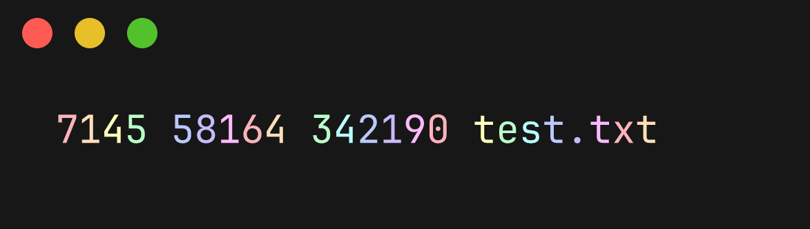

# rainbo-wc

A colorful practice project implementing wc in Rust

## Usage

Supports most of the modes wc offers.

If you want specific output, you can specify modes with the following flags:

- `-w`, `--words`: Print word count
- `-l`, `--lines`: Print line count
- `-c`, `--bytes`: Print byte count
- `-m`, `--chars`: Print character count

Output will render in glorious pastel rainbow colors, if your terminal supports it.

```shell-session
$ rainbo-wc test.txt
```


## Installation

### Compile from source

```shell-session
cargo build --release
```

### Or just run it with

```shell-session
cargo run -- <flags> <filename>